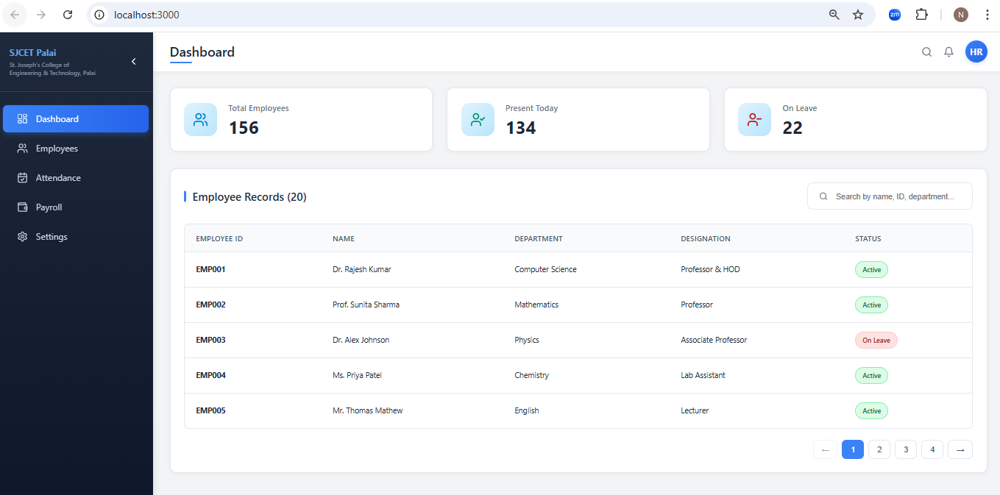

# 🏫 **College HRMS Dashboard** - St. Joseph's College of Engineering and Technology, Palai



## 📋 **Project Overview**
A responsive Human Resource Management System (HRMS) Dashboard UI designed for the HR department of **St. Joseph's College of Engineering and Technology, Palai**. This dashboard provides a clean and intuitive interface for managing employee records, tracking attendance, and viewing college staff statistics.

This project was developed as part of a **Frontend Developer Assessment**.

---

## 🚀 **Live Demo**
**Live URL:** [https://college-hrms-dashboard.netlify.app](https://college-hrms-dashboard.netlify.app)

---

## ✅ **Features Implemented**

### 📊 **Core Features**

| Feature | Description | Status |
|---------|-------------|--------|
| **📂 Sidebar Navigation** | 5 menu items: Dashboard, Employees, Attendance, Payroll, Settings | ✅ Complete |
| **🔝 Header Section** | Page title, Profile icon, Notification icon | ✅ Complete |
| **📊 Statistics Cards** | Total Employees (156), Present Today (134), On Leave (22) | ✅ Complete |
| **📋 Employee Table** | Employee ID, Name, Department, Designation, Status | ✅ Complete |
| **🔍 Search Functionality** | Real-time search across all fields (Bonus Feature) | ✅ Complete |
| **📱 Responsive Design** | Fully responsive on Desktop, Tablet, and Mobile | ✅ Complete |
| **📄 Pagination** | 5 records per page with navigation buttons | ✅ Complete |
| **🏷️ Status Badges** | Color-coded badges for Active/On Leave status | ✅ Complete |

### 🛠️ **Technical Features**

- ✅ **Component-Based Architecture** - Reusable, modular components
- ✅ **ES6+ Syntax** - Modern JavaScript practices
- ✅ **Pure CSS** - No frameworks or UI kits
- ✅ **Mobile-First Approach** - Designed for all screen sizes
- ✅ **Collapsible Sidebar** - Smooth transitions
- ✅ **Hardcoded JSON Data** - 20 employee records

---

## 📁 **Folder Structure**
college-hrms-dashboard/
├── public/
│   └── index.html
├── src/
│   ├── components/
│   │   ├── layout/
│   │   │   ├── Layout.jsx         # Main layout wrapper
│   │   │   ├── Sidebar.jsx        # Navigation sidebar (collapsible)
│   │   │   └── Header.jsx         # Page header with icons
│   │   ├── dashboard/
│   │   │   ├── StatsCard.jsx      # Reusable statistics card
│   │   │   └── EmployeeTable.jsx  # Employee table with search/pagination
│   │   └── common/
│   │       └── Pagination.jsx     # Reusable pagination component
│   ├── data/
│   │   └── mockData.js            # Hardcoded employee data (20 records)
│   ├── styles/
│   │   └── dashboard.css          # All custom styles
│   ├── App.js                      # Main app component
│   └── index.js                    # Entry point
├── screenshots/
│   ├── desktop.png                 # Desktop view screenshot
│   ├── tablet.png                  # Tablet view screenshot
│   └── mobile.png                  # Mobile view screenshot
├── package.json
└── README.md


---

## 🏗️ **Component Architecture**
App.js
│
├── Layout
│   ├── Sidebar
│   │   ├── Dashboard (nav item)
│   │   ├── Employees (nav item)
│   │   ├── Attendance (nav item)
│   │   ├── Payroll (nav item)
│   │   └── Settings (nav item)
│   ├── Header
│   │   ├── Page Title
│   │   ├── Notification Icon
│   │   └── Profile Icon
│   └── Content
│       ├── StatsSection
│       │   ├── StatsCard (Total Employees)
│       │   ├── StatsCard (Present Today)
│       │   └── StatsCard (On Leave)
│       └── EmployeeTable
│           ├── Search Box
│           ├── Table
│           └── Pagination


### **Component Descriptions**

| Component | Type | Description |
|-----------|------|-------------|
| **Layout** | Container | Manages responsive behavior, sidebar state, and overall structure |
| **Sidebar** | Presentation | Displays navigation items with active state, collapsible on desktop |
| **Header** | Presentation | Shows page title and user action icons |
| **StatsCard** | Reusable | Displays statistics with appropriate icons and colors |
| **EmployeeTable** | Container | Handles employee data, search filtering, and pagination logic |
| **Pagination** | Reusable | Provides page navigation controls |

---

## 📱 **Responsive Design Breakpoints**

| Device | Screen Width | Layout Features |
|--------|--------------|-----------------|
| **Desktop** | >1024px | Full sidebar (280px), 3-column statistics, full table view |
| **Tablet** | 769px - 1024px | Smaller sidebar (240px), 2-column statistics, auto-collapsed sidebar option |
| **Mobile** | ≤768px | Hamburger menu, hidden sidebar (slides in), 1-column statistics, horizontal scroll table |
| **Small Mobile** | ≤480px | Optimized touch targets, compact header, smaller fonts |

### **Mobile-Specific Features**
- ✅ Hamburger menu button (☰) in top-left
- ✅ Sidebar slides in from left when opened
- ✅ Dark overlay behind sidebar when open
- ✅ Tap overlay to close sidebar
- ✅ Horizontal scroll for table (swipe left/right)
- ✅ Touch-friendly pagination buttons

---

## 🛠️ **Technologies Used**

| Technology | Version | Purpose |
|------------|---------|---------|
| **React** | 18.2.0 | Frontend UI library |
| **Lucide React** | 0.263.1 | Beautiful, consistent icons |
| **CSS3** | - | Pure CSS styling (no frameworks) |
| **Create React App** | 5.0.1 | Project bootstrapping and build tool |

### **Why These Technologies?**
- **React**: Component-based architecture matches assessment requirements
- **Lucide React**: Lightweight icon library with no bloat
- **Pure CSS**: Meets "no UI kits" requirement, complete control over styling
- **CRA**: Standard React setup with minimal configuration

---

## 📊 **Data Structure**

### **Statistics Data** (mockData.js)
```javascript
{
  totalEmployees: 156,
  presentToday: 134,
  onLeave: 22
}

## **Employee Data (mockData.js)**
[
  {
    id: 'EMP001',
    name: 'Dr. Rajesh Kumar',
    department: 'Computer Science',
    designation: 'Professor & HOD',
    status: 'Active'
  },
  // ... 19 more records
]

🚀 Setup Instructions
📋 Prerequisites
Before you begin, ensure you have the following installed:

Requirement	Version	Check Command
Node.js	v14.0.0 or higher	node --version
npm	v6.0.0 or higher	npm --version
Git	Any recent version	git --version
📥 Installation Steps
Step 1: Clone the Repository
Open your terminal and run:

bash
# Clone using HTTPS
git clone https://github.com/yourusername/college-hrms-dashboard.git

# Or clone using SSH
git clone git@github.com:yourusername/college-hrms-dashboard.git

# Navigate into the project folder
cd college-hrms-dashboard
Step 2: Install Dependencies
Install all required packages:

bash
# Using npm
npm install

# OR using yarn
yarn install
This will install:

react & react-dom (v18.2.0)

react-scripts (v5.0.1)

lucide-react (v0.263.1) - For icons

Step 3: Start the Development Server
bash
# Using npm
npm start

# OR using yarn
yarn start
This will:

✅ Start the development server at http://localhost:3000

✅ Automatically open the app in your default browser

✅ Enable hot reloading (page refreshes when you make changes)

Step 4: View the Application
Open your browser and navigate to:

text
http://localhost:3000
You should see the College HRMS Dashboard with:

Sidebar navigation

Statistics cards

Employee table

Search functionality

🏗️ Build for Production
To create an optimized production build:

bash
# Using npm
npm run build

# OR using yarn
yarn build
This creates a build folder with:

✅ Minified and optimized code

✅ Hashed file names for caching

✅ Ready for deployment

🌐 Deployment Options
Option A: Deploy to Netlify (Recommended - Free)
Build the project

bash
npm run build
Deploy using Netlify CLI

bash
# Install Netlify CLI
npm install -g netlify-cli

# Deploy
netlify deploy
OR

Deploy via Netlify Drag & Drop

Go to app.netlify.com

Drag and drop the build folder

Get your live URL instantly

Option B: Deploy to Vercel
bash
# Install Vercel CLI
npm install -g vercel

# Deploy
vercel
Option C: Deploy to GitHub Pages
bash
# Install gh-pages
npm install --save-dev gh-pages

# Add to package.json
# "homepage": "https://yourusername.github.io/college-hrms-dashboard"

# Deploy
npm run deploy
🛠️ Available Scripts
Command	Description
npm start	Starts development server at localhost:3000
npm run build	Creates production build in build folder
npm test	Runs test suite (if tests are added)
npm run eject	Ejects from Create React App (one-way operation)
📦 Dependencies
json
{
  "dependencies": {
    "react": "^18.2.0",
    "react-dom": "^18.2.0",
    "react-scripts": "5.0.1",
    "lucide-react": "^0.263.1"
  }
}
🔧 Troubleshooting
Common Issues and Solutions
Issue	Solution
Port 3000 already in use	Run npm start -- --port 3001
Module not found errors	Run npm install again
Styles not loading	Clear browser cache
Node version issues	Use nvm use 18 if using nvm
Environment Variables
Create a .env file in the root directory:

env
# Optional: Change port
PORT=3000

# Optional: Disable browser opening
BROWSER=none
✅ Verification Checklist
After setup, verify:

App runs at http://localhost:3000

Sidebar navigation is visible

Statistics cards show numbers

Employee table displays data

Search functionality works

Pagination works

Mobile responsive design works

No console errors (F12 → Console tab)

📂 Project Structure After Setup
text
college-hrms-dashboard/
├── node_modules/          # Dependencies (auto-generated)
├── public/                # Public assets
├── src/                   # Source code
├── package.json           # Dependencies and scripts
├── package-lock.json      # Locked dependency versions
├── README.md              # This file
└── .gitignore             # Git ignore rules
🚨 Important Notes
⚠️ This project uses mock data - no backend required

⚠️ Sidebar items are UI only (as per assessment requirements)

⚠️ For mobile testing, use Chrome DevTools device toolbar

⚠️ The app is fully responsive - test on all screen sizes

💡 Quick Start Commands (Summary)
bash
# One-liner to get started
git clone https://github.com/yourusername/college-hrms-dashboard.git
cd college-hrms-dashboard
npm install
npm start
📞 Need Help?
If you encounter any issues:

Check the Troubleshooting section above

Open an issue on GitHub

Contact the developer

🎯 Next Steps After Setup
Once the app is running:

✅ Explore the dashboard features

✅ Test responsive design

✅ Try the search functionality

✅ Check pagination

✅ View on different devices

✅ Take screenshots for submission

📝 Complete README.md with Setup Instructions
Here's the complete README.md file with the setup instructions included:

markdown
# 🏫 **College HRMS Dashboard** - St. Joseph's College of Engineering and Technology, Palai

## 📋 Project Overview
A responsive Human Resource Management System (HRMS) Dashboard UI for college management system, built with React.

## ✨ Features
- ✅ Sidebar Navigation (5 items)
- ✅ Header with Profile & Notification icons
- ✅ Statistics Cards (3 cards)
- ✅ Employee Table with 5 fields
- ✅ Pagination
- ✅ Search Functionality (Bonus)
- ✅ Fully Responsive

## 🚀 Setup Instructions

### Prerequisites
- Node.js (v14 or higher)
- npm or yarn

### Installation

1. **Clone the repository**
   ```bash
   git clone https://github.com/yourusername/college-hrms-dashboard.git
   cd college-hrms-dashboard
Install dependencies

bash
npm install
Start the development server

bash
npm start
Open the app
Navigate to http://localhost:3000

Build for Production
bash
npm run build
📁 Folder Structure
text
src/
├── components/
│   ├── layout/
│   │   ├── Layout.jsx
│   │   ├── Sidebar.jsx
│   │   └── Header.jsx
│   ├── dashboard/
│   │   ├── StatsCard.jsx
│   │   └── EmployeeTable.jsx
│   └── common/
│       └── Pagination.jsx
├── data/
│   └── mockData.js
├── styles/
│   └── dashboard.css
├── App.js
└── index.js
📸 Screenshots
[Add screenshots here]

👨‍💻 Author
Your Name - your.email@example.com

📄 License
MIT

text

---

## ✅ **Quick Copy Instructions**

1. **Copy the entire "Setup Instructions" section** above
2. **Open your README.md** file
3. **Paste it** where you want the setup instructions to appear
4. **Replace placeholders:**
   - `yourusername` → Your GitHub username
   - `your.email@example.com` → Your email
   - `Your Name` → Your name

The setup instructions are now complete and ready for your assessment submission! 🚀